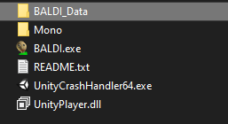
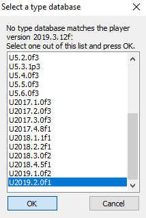

# Modyfying Audio (Unity Method)
## Extracting assets
Once you have UABE installed, open it, click "File" and "Open"

After that, search for the directory where is your Baldi's Basics copy located.

Go to BALDI_Data (or other AppName_Data) and select the `.assets` file, you want to edit.

If you did open the `.assets` file, your UABE should look like that.

Sort the assets by Type, by clicking Type. To select all assets with the one specific type (which for this case is AudioClip), you can just select the first asset, scroll down to the last Texture2D and `Ctrl+Shift+Click` it.

After that, click Plugins button, Export sound and click OK.

Make a new folder where you will extract the assets.
Folders I recommend you to to make:
1. Folder with the all original assets from Baldi's Basics untouched as a backup
2. Folder with the original assets and the modified ones
3. Folder with **ONLY** the modified audio

- Note: The audio format needs to be `.wav`

## What's next after modyfying the audio?

## Modyfying multiple audios

Open up Unity Hub and make a new 3D Project, set the editor version to `2019.3.12f1` and name it whatever you like.

Open up the project in Unity and drag the modded audio files into your Unity Project. The audio files you just added to your Unity Project need to be dragged to the 3D void.

- OPTIONAL STEP: Select the audio force it to Mono, and Apply the Changes. 

When you're finished adding the audios to the Unity Project, go to the left bottom of Unity, click `File`, click `Build Settings` and click Build. After that select the folder where your Unity Project will be built.

Open up UABE and this time, search for the folder where you built your Unity project, go to `MYPROJECTNAME_DATA` and select `sharedassets0.assets` file. Your UABE should show that it can't find a file database, so scroll down and select the last one of the option list and press OK.

Select all the audio, press Export Dump and make a new folder where you will store your dumps. Open extracted the text files in Notepad++ or Visual Studio Code and search for the `Replace in Files` option, to make removing file name suffixes faster. Then replace the `-sharedassetsX.assets-` with an empty text. After you do that, delete the numbers that are next to in the Audio name, so the name for exaple would look lke that: `1PR_AmComing`. Next, replace the `sharedassets0.resource` with `myCustomName.resource` (you can set the name to whatever you like, obviously) and save all the Text files.

Open your folder with the dumps and remove the suffixes from the file names.

Next, open up UABE and search for your Baldi's Basics folder and open the `sharedassetsX.assets` file with the audio you want to modify.

Click the audio name you want to modify, next press Import Dump and search for the Dump that matches with the name of the audio. Repeat this, until you do this with all the audios that you want to modify and click save the changes.

Finally, copy the `sharedassets0.resource` file from your Unity project, rename the file to `myCustomName.resource` and drag it into the `BALDI_Data` folder.

# I'll write the rest later, be patient