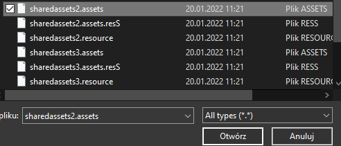
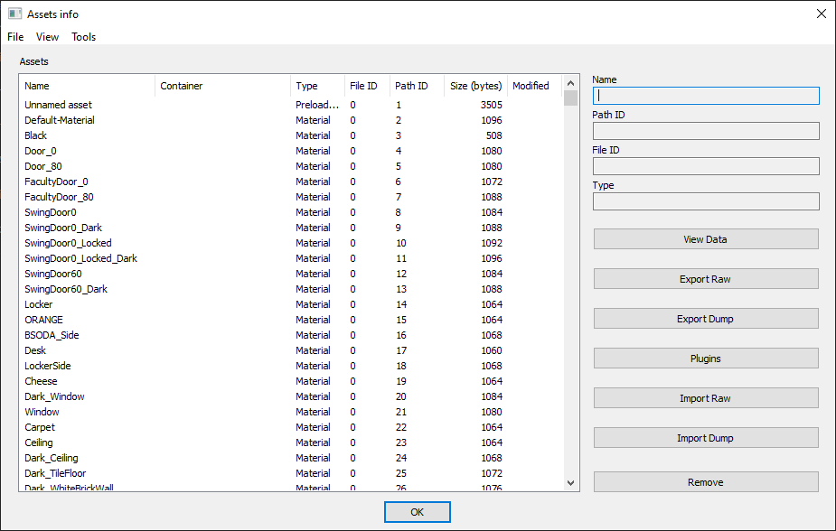

# Modyfying Audio (WIP)
## Extracting assets
Once you have UABE installed, open it, click "File" and "Open"

After that, search for the directory where is your Baldi's Basics copy located.

Go to BALDI_Data (or other AppName_Data) and select the `.assets` file, you want to edit.

If you did open the `.assets` file, your UABE should look like that.

Sort the assets by Type, by clicking Type. To select all assets with the one specific type (which for this case is AudioClip), you can just select the first asset, scroll down to the last Texture2D and `Ctrl+Shift+Click` it.

After that, click Plugins button, Export sound and click OK.

Make a new folder where you will extract the assets.
Folders I recommend you to to make:
1. Folder with the all original assets from Baldi's Basics untouched as a backup
2. Folder with the original assets and the modified ones
3. Folder with **ONLY** the modified audio

# I'll write the rest later, be patient