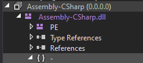

# Go to section:
- [Main](#Main)
- [Sharedassets#.assets references](#Sharedassets-references)
- [Modding Textures](#Modding-Textures)
- [Modding Audio](#Modding-Audio)
- [Coding](#Coding)
- [Decompiling](#Decompiling)
- [Recommended Programs to Mod the game](#Recommended-Programs)

# Main
Ever wanted to mod Baldi's Basics? Well no worries, this guide is here to help you. I'm not sure what else to say. Just check the stuff you want to mod.

# Sharedassets references
- globalgamemanagers.assets - The cursor, the mystman12 and Meta Game Jam logo.
0. Warning Screen
1. Title Screen
2. School
3. Game Over Screens
4. Normal Ending
5. Secret ending (filename2)
6. The secret room you can enter into, when you answer 31718 to any math question

# Modding Textures
## Required program
- [Unity Assets Bundle Extractor](https://github.com/SeriousCache/UABE/releases/tag/2.2stabled) (UABE)
## How to modify textures?
- Read [this document](Textures.md). It has basic necessary knowledge you need to know, while modding textures while using UABE.

# Modding Audio
### Required programs
- [Unity Assets Bundle Extractor](https://github.com/SeriousCache/UABE/releases/tag/2.2stabled) (UABE, can be helpful in UnityEX method)
- [Unity 2019.3.12](https://unity3d.com/unity/whats-new/2019.3.12) (recommended version)
- [UnityEX](https://www.mediafire.com/file/t8umkb9empr7vz7/UnityEX.zip/file) (alternative to Unity)
### How to modify audio?
- There are two methods of modyfying audio.
- - [UnityEX Method](AudioUnityEX.md)
- - [Unity Method](Audio.md) (more difficult)

# Coding
### Required programs
- [dnSpy](https://github.com/dnSpy/dnSpy/releases/tag/v6.1.8)
### How to change the game's code?
- Open dnSpy and search for `Assembly-CSharp.dll`, which is located in `BALDI_Data/Managed` directory.
- At the left column, there's a file list. Search for the file you opened, and click on the little arrow next to the file name and do it again. Now, you should see three file contents which are `PE`, `Type References` and `-`. Click on the `-` and you'll see a bunch of the game scripts.

- Choose the game script you would want to edit and click on it.
- Now, if you want to edit the script, click Right mouse button on the game code and choose `Edit Method (C#)` or `Edit Class (C#)`.
- After you're done editing the code, press `Compile`
- - Note: You can't compile the scripts, when errors are detected
- When you managed to compile the code, you can now click `File` at the left top of dnSpy, choose `Save Module` and press OK.
- If you want to know edit the item names, click [here](CodingItemNames.md).

# Decompiling
### Reruired programs
- [uTinyRipper](https://sourceforge.net/projects/utinyripper/files/)
- [Unity](https://unity3d.com/get-unity/download/archive) (not sure about that if you can still use the same version mentioned above in the [modding audio section (2019.3.12)](#required-programs), or use the the [2018.1.1](https://unity3d.com/unity/whatsnew/unity-2018.1.1) version)
### How to decompile the game?
- To decompile the game, just drag the folder with your Baldi's Basics Classic to uTinyRipper. After that, choose/make a fodler where you'll store the decompiled game.
- To check how the decompiled game looks like, open Unity Hub, add a new unity Project and select the folder with the decompiled game and open it. Opening it is gonna take a while...
- When the project is Open, click on the Scene folder and click the scene you want to see.
- If the school (or any scene you want to laod) is displayed on Unity, it means it works and you're kinda ready to make a decompile mod.
- I also recommend watching this video by [clicking here](https://youtu.be/ZDs7Rn9pVVM?t=364)

# Recommended Programs
### For modyfying textures
- [Paint.net](https://www.dotpdn.com/downloads/pdn.html)
### For modyfying audio
- [Audacity](https://www.audacityteam.org/download/)
### For modyfying text files (dumps)
- [Notepad++](https://notepad-plus-plus.org/downloads/)
- [Visual Studio Code](https://code.visualstudio.com/download)
