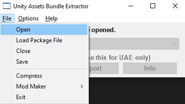
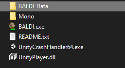
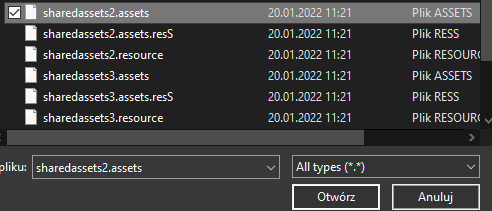
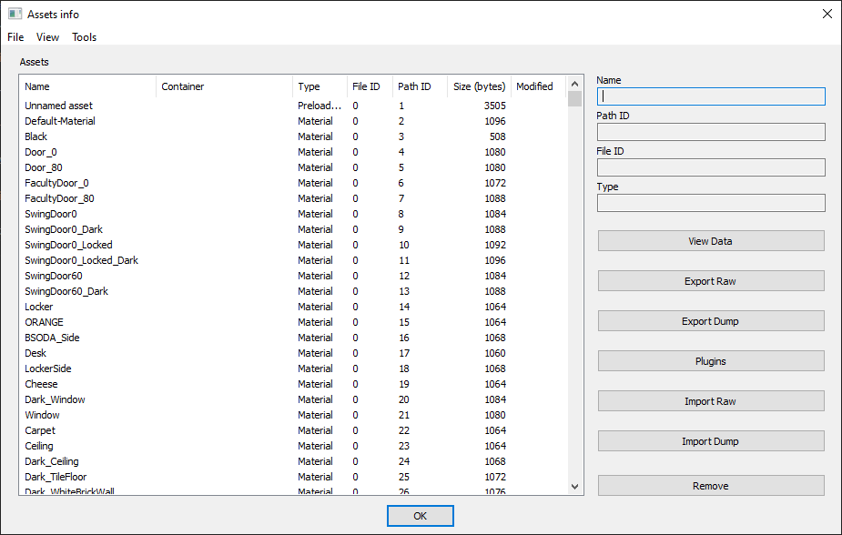
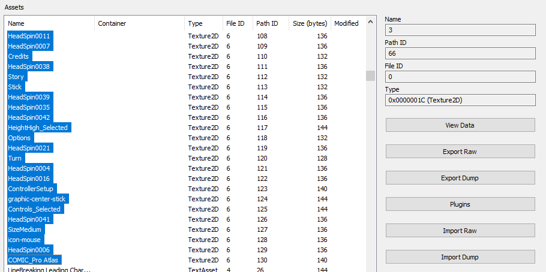
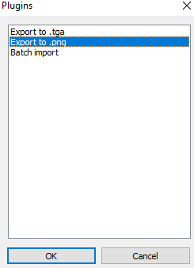
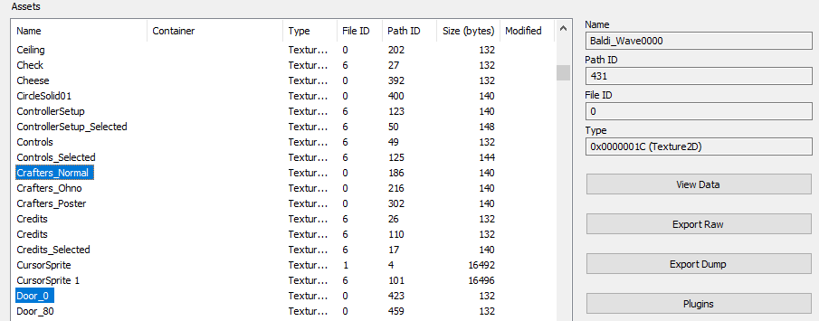
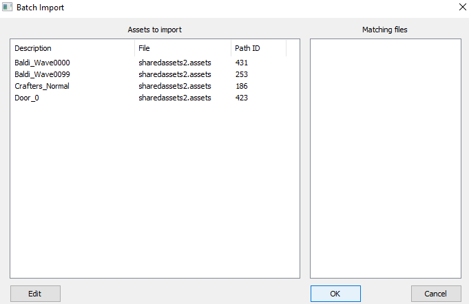
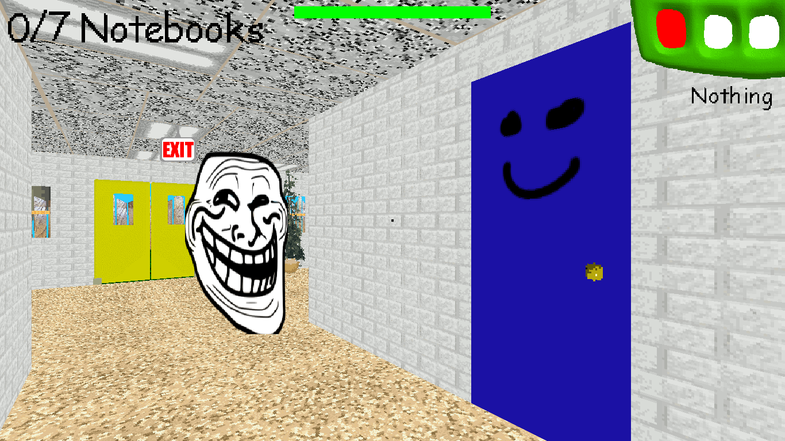

# Modyfying Textures
[Click here](README.md) to go back to the Main guide
## Extracting assets
Once you have UABE installed, open it, click "File" and "Open"

After that, search for the directory where is your Baldi's Basics copy located.

Go to BALDI_Data (or other AppName_Data) and select the `.assets` file, you want to edit.

If you did open the `.assets` file, your UABE should look like that.

Sort the assets by Type, by clicking Type. To select all assets with the one specific type (which for this case is Texture2D), you can just select the first asset, scroll down to the last Texture2D and `Ctrl+Shift+Click` it.

After that, click Plugins button and Export the assets `.png` (or `.tga` if you have Paint.net) and click OK.

Make a new folder where you will extract the assets.
Folders I recommend you to to make:
1. Folder with the all original assets from Baldi's Basics untouched as a backup
2. Folder with the original assets and the modified ones
3. Folder with **ONLY** the modified textures

## What to do next when the assets are extracted and edited?

When you edited the assets, you have to open UABE again, and repeat the process above, until you open the `.assets` file.
Select (only) the assets you want to replace by `Ctrl+Click`ing them.

Press the "Plugins" button and choose "Batch import". After that, you'll need to search for the folder with the assets you want to replace and select it.

If you see `*` in the row of the asset, it means you successfully managed to modify the asset.
When you're done, save the modified `.assets` file and replace it.

I recommend you to make a backup file of the original `.assets` file too, just in case if you mess something up.

## The results

This my result of successfully modified textures. Hope you managed to edit your own textures and add the changes

